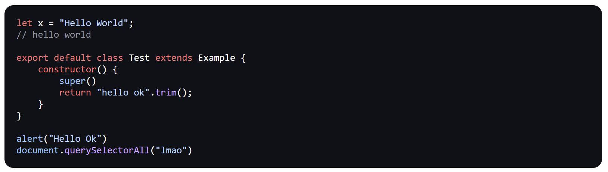

# Zero Code

Syntax highlighter web component. Very limited and not tested. Also not using the latest version of Zero (although I will try to keep all code backwards compatible because it's in the [Zero Framework Blog](https://github.com/nathan-pham/zero-framework-blog)) Anyways the regex principles still stand.

## Usage

After importing the `Zero` "framework" and z-code web component, you will be able to use `z-code` like an HTML element.

```html
<!-- prettier-ignore -->
<z-code data-type="js">
let x = "Hello World";
// hello world

export default class Test extends Example {
    constructor() {
        super()
        return "hello ok".trim();
    }
}

alert("Hello Ok")
document.querySelectorAll("lmao")
</z-code>
```

## Screenshots


